# Azure Application Insights Java Demo

A comprehensive Java Spring Boot demo application showcasing Azure Application Insights integration with custom telemetry, automated deployment, and containerization.

## 🏗️ Architecture Overview

```mermaid
graph TB
    %% User Layer
    User[👤 User/Developer] --> Browser[🌐 Web Browser]
    Browser --> LB[⚖️ Load Balancer]
    
    %% Deployment Options
    LB --> |Option 1| Local[🖥️ Local Development]
    LB --> |Option 2| Docker[🐳 Docker Container]
    LB --> |Option 3| K8S[☸️ Kubernetes/AKS]
    
    %% Application Layer
    Local --> SpringApp[🍃 Spring Boot Application]
    Docker --> SpringApp
    K8S --> SpringApp
    
    %% Application Components
    SpringApp --> WebUI[🎨 Interactive Web UI<br/>Modern CSS & JavaScript]
    SpringApp --> RestAPI[🔗 REST API Endpoints<br/>/api, /health, /error]
    SpringApp --> Controller[🎮 Demo Controller<br/>Telemetry Generation]
    
    %% Telemetry Collection
    SpringApp --> AIAgent[📊 Application Insights Agent<br/>v3.7.4]
    Controller --> CustomTelemetry[📈 Custom Telemetry<br/>Events, Metrics, Traces]
    
    %% Configuration
    SpringApp --> Config[⚙️ Configuration<br/>applicationinsights.json<br/>application.properties]
    
    %% Azure Services
    AIAgent --> |HTTPS| AIService[☁️ Azure Application Insights<br/>Australia East]
    CustomTelemetry --> |HTTPS| AIService
    
    AIService --> Portal[📱 Azure Portal<br/>Live Metrics, Logs, Dashboards]
    AIService --> Alerts[🚨 Alerts & Monitoring]
    AIService --> Analytics[📊 Analytics & KQL Queries]
    
    %% Container Registry
    Docker --> DockerHub[🐳 Docker Hub<br/>khanasif1/azure-appinsights-java-demo]
    
    %% Kubernetes Resources
    K8S --> K8SNamespace[📦 Namespace: appinsightdemo]
    K8SNamespace --> K8SDeployment[🚀 Deployment<br/>2 Replicas]
    K8SNamespace --> K8SService[🔗 LoadBalancer Service<br/>Port 80→8082]
    K8SNamespace --> K8SConfig[⚙️ ConfigMap & Secret<br/>Environment Variables]
    
    %% Development Tools
    Developer[👨‍💻 Developer] --> IDE[💻 VS Code/IntelliJ]
    IDE --> Maven[📦 Maven Build<br/>Dependencies & Packaging]
    Maven --> JAR[📄 Executable JAR<br/>app.jar]
    
    %% CI/CD Pipeline
    Developer --> Git[📚 Git Repository<br/>GitHub]
    Git --> Build[🔨 Build Process<br/>Maven Package]
    Build --> Test[🧪 Unit Tests<br/>Integration Tests]
    Test --> Package[📦 Docker Build]
    Package --> Deploy[🚀 Deployment<br/>Local/K8S/Docker Hub]
    
    %% Monitoring & Observability
    AIService --> Metrics[📈 Performance Metrics<br/>Response Time, Throughput]
    AIService --> Logs[📋 Application Logs<br/>Structured Logging]
    AIService --> Traces[🔍 Distributed Tracing<br/>Request Flow]
    AIService --> Dependencies[🔗 Dependency Tracking<br/>External Calls]
    
    %% Health & Probes
    K8SDeployment --> HealthCheck[💚 Health Checks<br/>Liveness & Readiness Probes]
    HealthCheck --> |/api/health| RestAPI
    
    %% Styling
    classDef azure fill:#0078d4,stroke:#005ba1,stroke-width:2px,color:#fff
    classDef spring fill:#6db33f,stroke:#4a8b2d,stroke-width:2px,color:#fff
    classDef docker fill:#2496ed,stroke:#1a75d9,stroke-width:2px,color:#fff
    classDef k8s fill:#326ce5,stroke:#2558d6,stroke-width:2px,color:#fff
    classDef user fill:#ff6b6b,stroke:#e63946,stroke-width:2px,color:#fff
    classDef monitoring fill:#f39c12,stroke:#d68910,stroke-width:2px,color:#fff
    
    class AIService,Portal,Alerts,Analytics azure
    class SpringApp,WebUI,RestAPI,Controller spring
    class Docker,DockerHub,Package docker
    class K8S,K8SNamespace,K8SDeployment,K8SService,K8SConfig k8s
    class User,Browser,Developer user
    class Metrics,Logs,Traces,Dependencies,HealthCheck monitoring
```



## 🔄 Data Flow Architecture


## 🛠️ Technology Stack


## 📊 Telemetry Features

- **Java 17 or higher** (tested with Java 25)
- **Maven 3.6+** or use included Maven wrapper
- **Docker** (for containerization)
- **Azure CLI** (for AKS deployment)
- **Azure subscription** with Application Insights resource

## 🚀 Quick Start

### 1. Clone and Setup

```bash
git clone <repository-url>
cd AzureAppInsight-Java-Demo/_src
```

### 2. Configure Application Insights

Update `applicationinsights.json` with your Application Insights connection string:

```json
{
  "connectionString": "InstrumentationKey=your-key;IngestionEndpoint=https://your-region.in.applicationinsights.azure.com/;LiveEndpoint=https://your-region.livediagnostics.monitor.azure.com/;ApplicationId=your-app-id"
}
```

### 3. Build and Run

#### Option A: Local Development (Java 17+)
```bash
# Build the application
./mvnw clean package -DskipTests

# Run with Application Insights agent
java --add-opens java.base/java.lang=ALL-UNNAMED \
     --add-opens java.base/sun.nio.ch=ALL-UNNAMED \
     -javaagent:applicationinsights-agent.jar \
     -jar target/azure-appinsight-demo-1.0.0.jar
```

#### Option B: Local Development (Java 25) - Windows PowerShell
```powershell
# Navigate to project directory
cd C:\_code\personal_github\AzureAppInsight-Java-Demo\_src

# Set Java Environment
$env:JAVA_HOME = "C:\Program Files\Java\jdk-25"
$env:PATH = "$env:JAVA_HOME\bin;" + $env:PATH

# Build the application
.\mvnw.cmd clean package -DskipTests

# Run with Application Insights agent (Java 25 compatible)
java --add-opens java.base/java.lang=ALL-UNNAMED --add-opens java.base/sun.nio.ch=ALL-UNNAMED -javaagent:applicationinsights-agent.jar -jar target\azure-appinsight-demo-1.0.0.jar
```

#### Option C: Docker
```bash
# Build Docker image
docker build -t azure-appinsight-demo .

# Run container
docker run -p 8080:8080 azure-appinsight-demo
```

### 4. Test the Application

Open http://localhost:8080 in your browser and test:

- **Home Page**: Automatic page view tracking
- **Error Button**: Simulate exceptions
- **Health Check**: GET /health endpoint
- **Custom Event**: POST /custom-event
- **Telemetry Test**: POST /test-telemetry

## 📊 Telemetry Features

### Automatic Telemetry (via Application Insights Agent)
- HTTP requests and responses
- Dependencies (database calls, HTTP calls)
- Exceptions and stack traces
- Performance counters
- Custom metrics

### Custom Telemetry (via OpenTelemetry API)
- Custom events with properties
- Custom metrics with dimensions
- Exception tracking with context
- Dependency calls with timing
- Page view tracking
- Distributed tracing spans

### API Endpoints

| Endpoint | Method | Description |
|----------|--------|-------------|
| `/` | GET | Home page with automatic telemetry |
| `/error` | POST | Simulate exception for testing |
| `/health` | GET | Health check with metrics |
| `/custom-event` | POST | Generate custom events |
| `/test-telemetry` | POST | Comprehensive telemetry test |

## 🧪 Testing Telemetry

### Verify Agent Installation
Check application logs for:
```
Application Insights Java Agent 3.4.19 started successfully
```

### Test Endpoints
Use the included web interface or test via PowerShell:

```powershell
# Test error tracking
Invoke-WebRequest -Uri "http://localhost:8080/error" -Method POST

# Test health endpoint
Invoke-WebRequest -Uri "http://localhost:8080/health" -Method GET

# Test custom telemetry
Invoke-WebRequest -Uri "http://localhost:8080/test-telemetry" -Method POST
```

### View in Azure Portal
1. Navigate to your Application Insights resource
2. Check **Live Metrics** for real-time data
3. Use **Logs** to query custom telemetry:
   ```kusto
   traces
   | where message contains "Custom Event"
   | project timestamp, message, severityLevel
   ```

## 🐳 Docker Deployment

### Build Image
```bash
docker build -t azure-appinsight-demo .
```

### Run Container
```bash
docker run -p 8080:8080 \
  -e APPLICATIONINSIGHTS_CONNECTION_STRING="your-connection-string" \
  azure-appinsight-demo
```

### Environment Variables
- `APPLICATIONINSIGHTS_CONNECTION_STRING`: Override connection string
- `JAVA_OPTS`: Additional JVM options

## ☸️ Kubernetes/AKS Deployment

### 1. Create AKS Cluster
```bash
# Create resource group
az group create --name rg_legit --location australiaeast

# Create AKS cluster
az aks create \
  --resource-group rg_legit \
  --name aks_legit \
  --node-count 3 \
  --enable-addons monitoring \
  --generate-ssh-keys
```

### 2. Deploy Application
```bash
# Get AKS credentials
az aks get-credentials --resource-group rg_legit --name aks_legit

# Apply Kubernetes manifests
kubectl apply -f k8s/
```

### 3. Access Application
```bash
# Get external IP
kubectl get services azure-appinsight-demo-service

# Or use port forwarding for testing
kubectl port-forward service/azure-appinsight-demo-service 8080:80
```

## 🔧 Configuration

### Application Insights Configuration

The application supports multiple configuration methods:

1. **applicationinsights.json** (preferred for containers)
2. **Environment variables**
3. **application.properties**

#### applicationinsights.json
```json
{
  "connectionString": "InstrumentationKey=xxx;IngestionEndpoint=https://xxx.in.applicationinsights.azure.com/;LiveEndpoint=https://xxx.livediagnostics.monitor.azure.com/;ApplicationId=xxx",
  "connectionStringConfiguredAtRuntime": true,
  "role": {
    "name": "azure-appinsight-demo",
    "instance": "demo-instance"
  },
  "customDimensions": {
    "application": "azure-appinsight-demo",
    "environment": "demo"
  }
}
```

#### Environment Variables
```bash
APPLICATIONINSIGHTS_CONNECTION_STRING="your-connection-string"
APPLICATIONINSIGHTS_ROLE_NAME="azure-appinsight-demo"
```

### Spring Boot Configuration

Key settings in `application.properties`:

```properties
# Application Insights
azure.application-insights.enabled=true
azure.application-insights.web.enable-W3C=true

# Logging
logging.level.com.demo=INFO
logging.level.io.opentelemetry=INFO

# Actuator
management.endpoints.web.exposure.include=health,info,metrics
```

## 🛠️ Development Setup

### VS Code Extensions
Install these recommended extensions:
- Extension Pack for Java
- Spring Boot Extension Pack
- Docker
- Azure Account
- Azure Kubernetes Service

### Project Structure
```
_src/
├── src/main/java/com/demo/
│   ├── AzureAppInsightDemoApplication.java  # Main application
│   ├── DemoController.java                  # REST controllers
│   └── TelemetryService.java               # Custom telemetry
├── src/main/resources/
│   ├── templates/index.html                # Web interface
│   ├── application.properties              # Spring config
│   └── applicationinsights.json            # AI agent config
├── k8s/                                    # Kubernetes manifests
├── applicationinsights-agent.jar           # AI agent
├── Dockerfile                              # Container config
└── pom.xml                                 # Maven dependencies
```

## 🔍 Troubleshooting

### Application Insights Agent Issues

**Problem**: Agent fails to start on Java 25
**Solution**: Use JVM flags:
```bash
--add-opens java.base/java.lang=ALL-UNNAMED --add-opens java.base/sun.nio.ch=ALL-UNNAMED
```

**Problem**: No telemetry in Azure portal
**Solution**: 
1. Verify connection string
2. Check network connectivity
3. Wait 2-3 minutes for data to appear
4. Check application logs for errors

### Build Issues

**Problem**: Maven compilation errors
**Solution**: 
```bash
# Clean and rebuild
./mvnw clean package -DskipTests
```

**Problem**: Java version compatibility
**Solution**: Use Java 17 for maximum compatibility

### Docker Issues

**Problem**: Container won't start
**Solution**: Check logs:
```bash
docker logs <container-id>
```

## 📚 Learning Resources

- [Application Insights Overview](https://docs.microsoft.com/azure/azure-monitor/app/app-insights-overview)
- [Java Agent Configuration](https://docs.microsoft.com/azure/azure-monitor/app/java-in-process-agent)
- [OpenTelemetry Java](https://opentelemetry.io/docs/instrumentation/java/)
- [Spring Boot with Application Insights](https://docs.microsoft.com/azure/developer/java/spring-framework/configure-spring-boot-java-applicationinsights)

## � Quick Reference Commands

### PowerShell (Windows)
```powershell
# All-in-one startup command

cd ~C:\_code\personal_github~\AzureAppInsight-Java-Demo\_src\maven;
$env:JAVA_HOME = "C:\Users\asifkhan\.jdk\jdk-21.0.8" ; $env:APPLICATIONINSIGHTS_CONNECTION_STRING = "InstrumentationKey=8a3054d4-0f22-466d-abc8-fbeb45d6a104;IngestionEndpoint=https://australiaeast-1.in.applicationinsights.azure.com/;LiveEndpoint=https://australiaeast.livediagnostics.monitor.azure.com/;ApplicationId=0568e94c-8c3e-4d1a-a3b1-1e2c4314cd2d" ; cd "c:\Users\asifkhan\Downloads\ApplicationInsights-Java\maven" ; & "C:\Users\asifkhan\.jdk\jdk-21.0.8\bin\java.exe" -javaagent:target/agent/applicationinsights-agent.jar -jar target/app.jar --server.port=8080

# Development mode (auto-restart)
.\mvnw.cmd spring-boot:run

# Run tests
.\mvnw.cmd test
```

### Bash (Linux/macOS)
```bash
# Build and run
./mvnw clean package -DskipTests
java --add-opens java.base/java.lang=ALL-UNNAMED --add-opens java.base/sun.nio.ch=ALL-UNNAMED -javaagent:applicationinsights-agent.jar -jar target/azure-appinsight-demo-1.0.0.jar

# Development mode
./mvnw spring-boot:run
```

## 🤝 Contributing

1. Fork the repository
2. Create a feature branch
3. Make your changes
4. Add tests if applicable
5. Submit a pull request

## 📄 License

This project is licensed under the MIT License - see the LICENSE file for details.

---

**Ready to monitor your Java applications with Azure Application Insights!** 🚀